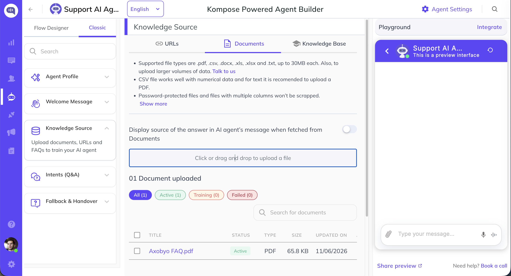
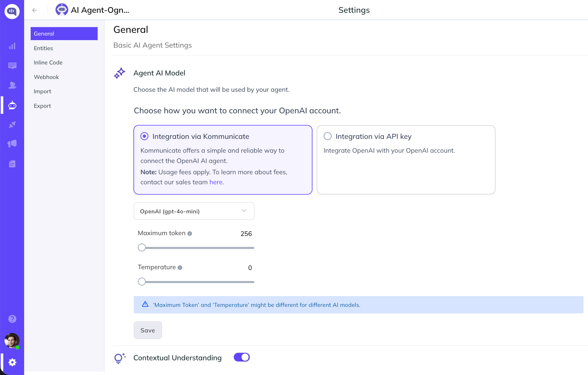
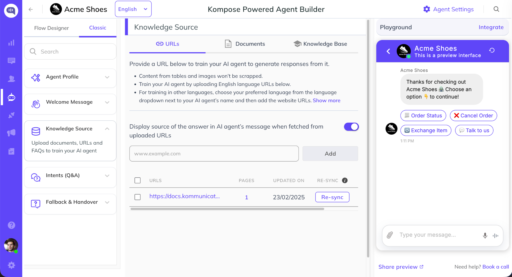
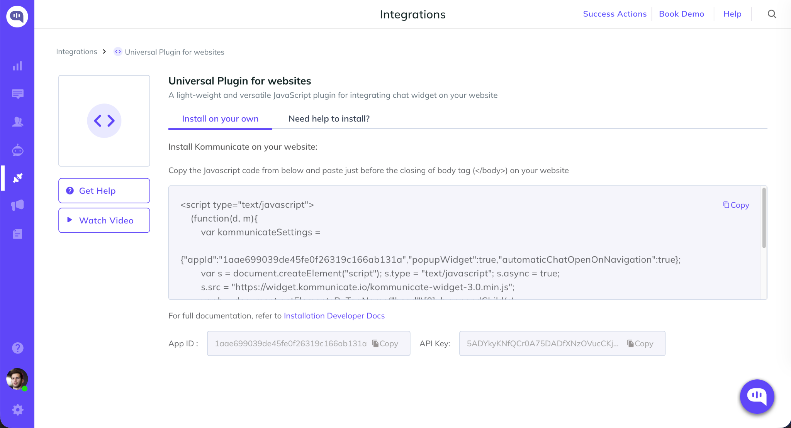
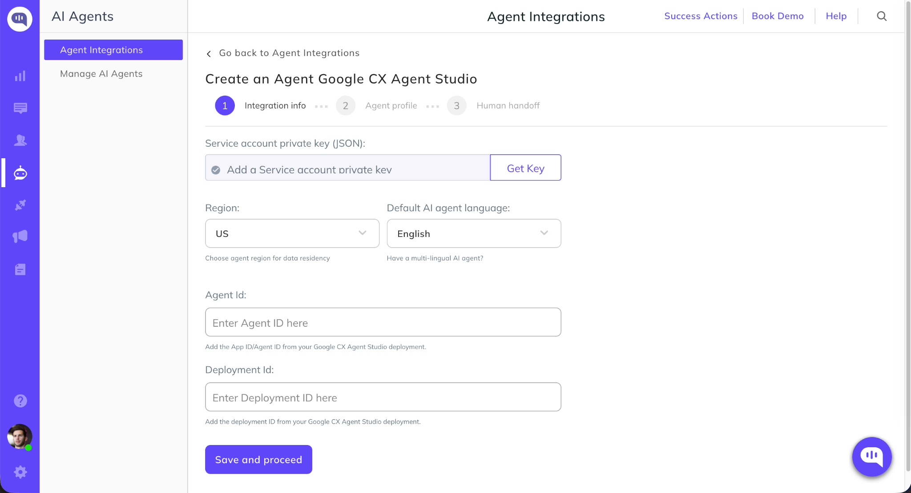
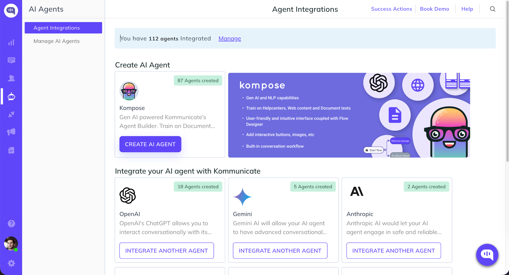
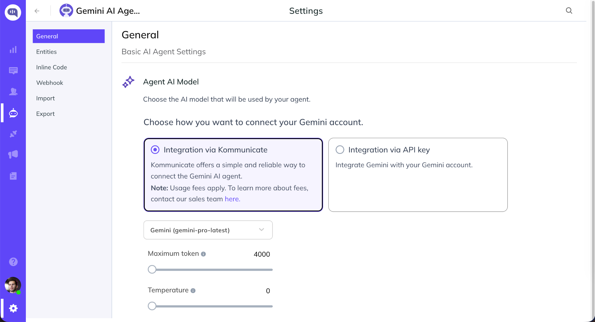

# Kommunicate AI Agent and Live Chat For Web

## Overview:

Kommunicate provides an open-source AI agent and live chat plugin for websites. The Kommunicate plugin is lightweight, flexible, and easy to integrate. Kommunicate AI agents can autonomously resolve customer support queries and are powered by natural language processing, the latest AI models from OpenAI, Anthropic, Google Gemini, and CX Agent Studio.

Kommunicate supports document and image uploads, location sharing, and rich messaging capabilities to create engaging customer experiences.

Kommunicate also includes a built-in human-in-the-loop support system. When an AI agent is unable to understand or resolve a customer query, it can seamlessly escalate the conversation to a live support agent. Human agents can then continue the conversation directly from the Kommunicate platform.

In addition, Kommunicate unifies customer conversations from websites, email, voice, and messaging channels such as WhatsApp, Telegram, Instagram, Viber, and LINE into a single platform, enabling better team collaboration, faster response times, and more efficient issue resolution.

## Build an AI agent on Kommunicate and integrate it into your website

## Kompose

Kompose is a no-code AI agent builder that helps businesses build and deploy customer support AI agents across chat, email, and voice channels. Creating an AI agent with Kompose requires no coding skills, simply upload your training materials and provide clear instructions on how the agent should respond and behave.

The Kommunicate platform includes a feature-rich chat widget with capabilities such as:

- File and attachment sharing
- Voice AI interactions
- Lead capture forms
- Rich messaging experiences
- Location sharing
- Human agent handoff
- Conversation analytics and reporting

Kommunicate also provides detailed insights into AI agent performance, helping teams identify unanswered queries, optimize responses, and continuously improve automation. When required, conversations can be seamlessly transferred from the AI agent to a human support representative, ensuring customers always receive the assistance they need. All conversations are centrally managed within the Kommunicate platform, allowing support teams to monitor, respond to, and track customer interactions efficiently.



## OpenAI Integration

Kommunicate's OpenAI integration enables businesses to deploy AI-powered customer support agents using OpenAI's latest models. These agents can answer customer queries, automate repetitive support tasks, and seamlessly transfer conversations to human agents when required.

### Integrations Options

You can connect OpenAI to Kommunicate in two ways:

#### Managed Integration via Kommunicate

- No OpenAI account setup required
- Select an OpenAI model directly within Kommunicate
- Simplified billing and configuration

#### Bring Your Own OpenAI API Key

- Connect your existing OpenAI account
- Full control over model selection and API usage
- Use your own OpenAI billing account

### Deployment Steps

#### Step 1: Create an AI Agent

Navigate to Agent Integrations and create a new AI agent using Kompose AI Agent Builder.


#### Step 2: Configure OpenAI

Choose either:

- Integration via Kommunicate and select an OpenAI model, or
- Integration via API Key and enter your OpenAI API credentials.

Configure model settings such as response length and creativity, then save your configuration.



#### Step 3: Train Your AI Agent

Upload documents, connect your help center, or add website URLs to build your AI agent's knowledge base.



#### Step 4: Deploy to Your Website

Navigate to Integrations -> Universal Plugins for Websites, copy the JavaScript snippet, and add it to your website.

Your OpenAI-powered AI agent is now ready to assist customers.



## Google CX Agent Studio Integration

Kommunicate integrates with Google CX Agent Studio, allowing organizations to deploy Dialogflow and CX Agent Studio agents through Kommunicate's omnichannel support platform.

### Why Use This Integration?

- Leverage existing Google CX Agent Studio agents
- Add live chat and human handoff capabilities
- Access centralized conversation management
- Deploy across web and mobile channels

### Steps to Deploy Google CX Agent Studio AI Agent with Kommunicate

#### Step 1: Connect Google CX Agent Studio



#### Step 2: Add Google Credentials

Enter the required Google Cloud and CX Agent Studio credentials, including project details and authentication information.

Once validated, Kommunicate will establish the connection with your Google agent.

#### Step 3: Deploy the Chat Widget

Navigate to Integrations -> Universal Plugins for Websites, copy the installation code, and add it to your website.

Your Google CX Agent Studio agent is now available through the Kommunicate chat widget.


## Google Gemini Integration

Kommunicate's Google Gemini integration enables businesses and developers to build, deploy, and manage AI-powered customer support agents across websites and digital channels. Use the latest AI models from Google Gemini.

### Ways to Connect Google Gemini with Kommunicate

You can create an Google Gemini-powered AI agent in Kommunicate using either of the following methods:

#### Integration via Kommunicate

Use Kommunicate's managed Google Gemini integration and select your preferred Gemini model directly from the platform.

#### Integration via Google Gemini API Key

Connect your own Google Gemini account by providing a Gemini API key and configuring the AI agent within Kommunicate.

### Setup Instructions

#### Step 1: Create an AI Agent:

After signing up for Kommunicate, navigate to Agent Integrations and create a new AI agent using Kompose AI Agent Builder or select Gemini integration.



#### Step 2: Choose Your Google Gemini Integration Method

Select how you would like to connect Google Gemini to your AI agent:

- Integration via Kommunicate - Choose a Google Gemini model directly from Kommunicate and start building your AI agent.
- Integration via API Key - Connect your Google Gemini account by entering your OpenAI API key and configuring the agent with your preferred model and settings.

Once configured, save the settings and begin training your AI agent with your website content, documents, or help center articles.


#### Step 3: Go to Integrations. Select Universal Plugins for Websites. Copy the JavaScript and add it to your website.


## Anthropic Integration

Kommunicate's Anthropic integration enables businesses and developers to build, deploy, and manage AI-powered customer support agents across websites and digital channels. Use the latest AI models from Anthropic and resolve customer support queries accurately and instantly.

### Ways to Connect Anthropic with Kommunicate

You can create an Anthropic-powered AI agent in Kommunicate using either of the following methods:

#### Integration via Kommunicate

Use Kommunicate's managed Anthropic integration and select your preferred Anthropic model directly from the platform.

#### Integration via Google Gemini API Key

Connect your own Anthropic account by providing an Anthropic API key and configuring the AI agent within Kommunicate.

### Setup Instructions

#### Step 1: Create an AI Agent:

After signing up for Kommunicate, navigate to Agent Integrations and create a new AI agent using Kompose AI Agent Builder or select Anthropic integration.


#### Step 2: Choose Your Anthropic Integration Method

Select how you would like to connect Anthropic to your AI agent:

- Integration via Kommunicate - Choose an Anthropic model directly from Kommunicate and start building your AI agent.
- Integration via API Key - Connect your Antropic account by entering your OpenAI API key and configuring the agent with your preferred model and settings.

Once configured, save the settings and begin training your AI agent with your website content, documents, or help center articles.



#### Step 3: Go to Integrations. Select Universal Plugins for Websites. Copy the JavaScript and add it to your website.


## Getting Started :

Create your account by [signing up](https://www.kommunicate.io/?utm_source=github&utm_medium=readme&utm_campaign=web) for Kommunicate. If you already have a Kommunicate account, log in to your account and go to [Settings -> Install](https://dashboard.kommunicate.io/settings/install) section and copy the script.

Or

You can copy the below script and replace the required parameters manually. Note: You will get your `<APP_ID>` in the [Install](https://dashboard.kommunicate.io/settings/install) section.

```html
<script type="text/javascript">
  (function(d, m){

    /*---------------- Kommunicate settings start ----------------*/

    var kommunicateSettings = {
      "appId": "<APP_ID>",
      "automaticChatOpenOnNavigation": true,
      "popupWidget": true
      /*
      "onInit": function (){
        // paste your code here
      },
      "botIds":["<BOT_ID_1>","<BOT_ID_2>"]
      */
    };

    /*----------------- Kommunicate settings end ------------------*/

    var s = document.createElement("script");
    s.type = "text/javascript";
    s.async = true;
    s.src = "https://widget.kommunicate.io/v2/kommunicate.app";
    var h = document.getElementsByTagName("head")[0];
    h.appendChild(s);
    window.kommunicate = m;
    m._globals = kommunicateSettings;
  })(document, window.kommunicate || {});
</script>
```

## Technical Documentation:

Please check out the [detailed documentation](https://docs.kommunicate.io/docs/web-installation.html) for more features, implementation and customizations.
