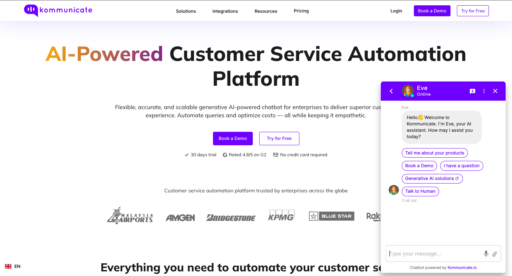
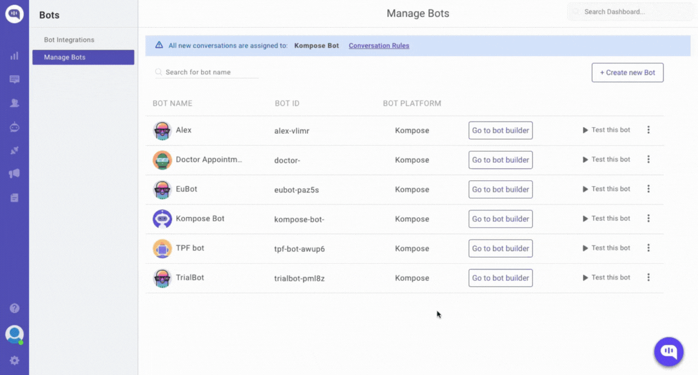
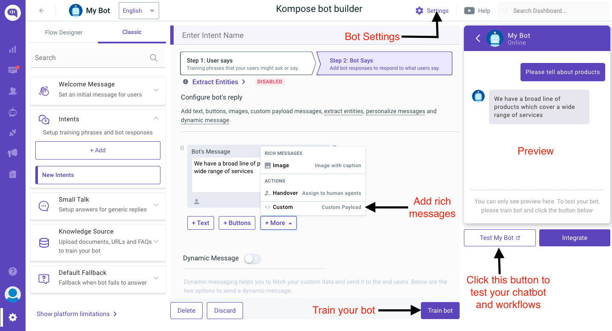

# [Kommunicate ](https://www.kommunicate.io/?utm_source=github&utm_medium=readme&utm_campaign=web)Live Chat Plugin and Chatbot Integration For Web

## Overview

Kommunicate provides open source live chat Plugin. The Kommunicate plugin is flexible, lightweight and easily integrable.
It lets you easily add real-time live chat and in-app messaging in your websites and web apps for customer support. The live chat plugin is equipped with advance messaging options such as real-time chat, sending attachments, sharing location and rich messaging.

Kommunicate has a powerful human + chatbot hybrid platform, where you can integrate Dialogflow and Amazon Lex chatbot without using any code. You can also integrate any third-party or custom chatbot in Kommunicate as well. The automatic bot to human handoff enabled, customizable and rich-messaging equipped chat-widget gives you ample options to make your chatbot more powerful.



## Build a BOT on Kommunicate and integrate it in your Website

### Kompose

[Kompose](https://dashboard.kommunicate.io/bots/bot-builder) is a Kommunicate’s bot builder that help you in building your own bot, a techie, non-techie, or a person who doesn’t have any idea about chatbots can also build the bot. Anyone can create a chatbot with the Kompose without any assistance.



### Following is the UI to create the BOT



## Dialogflow Chatbot Integration

Dialogflow is a Google-owned NLP platform to facilitate human-computer interactions such as chatbots, voice bots, etc.

Kommunicate's Dialogflow integration provides a more versatile, customizable and better chatting experience. Kommunicate chat widget supports all of Dialogflow's features such as Google Assistant, Rich Messaging, etc. On top of that, it is equipped with advanced features such as bot-human handoff, conversation managing dashboard, reporting, and others.

You can connect your Dialogflow chatbot with Kommunicate in the following 4 simple steps. [Here](https://www.youtube.com/watch?v=ZlrFYRwJxS8) is a video for the same.

### Step 1: Get your API credentials from Dialogflow

-   Login to Dialogflow console and select your agent from the dropdown in the left panel.
-   Click on the settings button. It will open a setting page for the agent.
-   Inside the general tab search for GOOGLE PROJECTS and click on your service account.
-   After getting redirected to your SERVICE ACCOUNT, create a key in JSON format for your project from the actions section and it will get automatically downloaded.

### Step 2: Create a free Kommunicate account

Create a free account on [Kommunicate](https://dashboard.kommunicate.io/signup) and navigate to the [Bots section](https://dashboard.kommunicate.io/bots/bot-integrations).

### Step 3: Integrate your Dialogflow chatbot with Kommunicate

-   In the Bot integrations section, choose Dialogflow. A popup window will open.
-   Upload your Key file here and proceed.
-   Give a name and image to your chatbot. It will be visible to the users chatting with your chatbot.
-   Enable/Disable chatbot to human handoff. If enabled, it will automatically assign conversations to humans in case the chatbot is not able to answer.

### Step 4: Install the chat widget on your website

You can install the Kommunicate chat widget on your website by adding a code snippet to your website. More information on how to integrate with your website [here](https://docs.kommunicate.io/docs/web-installation.html).

> Note: Here's a [sample chatbot](https://docs.kommunicate.io/docs/bot-samples) for you to get started with Dialogflow.

## Amazon Lex Integration

Amazon Lex is an AWS service for building conversational interfaces using voice and text, enabling human-computer interactions such as chatbots, voice bots, etc.

Kommunicate's Amazon Lex integration offers a more versatile, customizable, and enhanced chatting experience. Additionally, it comes equipped with advanced features such as bot-human handoff, a conversation management dashboard, reporting, and more.

You can integrate Amazon Lex Bot with Kommunicate by following the below steps. [Here](https://www.youtube.com/watch?v=cuaAiutVkow) is a video for the same.

### Step 1: Get your credentials from Amazon Lex

**A. Access Key ID & Secret access key:** An access key ID and secret access key are required to sign requests you make using the AWS SDKs. To get your access key [sign into your AWS console](https://aws.amazon.com/console/) as a Root or IAM user.

1. Open the [Identity and Access Management (IAM)](https://us-east-1.console.aws.amazon.com/iam/) panel in the same AWS account where the Lex bot is present.

2. Go to Access management -> Users. Create a user by clicking the Add Users button. Add a user name, e.g., "Lex-bot".

3. Set permissions: Choose "Attach Policies Directly".

4. Select the following two permissions: AmazonLexReadOnly & AmazonLexRunBotsOnly.

5. Keep the "Tags" empty and proceed to Next.

6. On the next page confirm the attached permissions to the user and click on “Create User”.

7. Now that your user is created, select the user, and on the next page click on Security Credentials.

8. Scroll down and click on Create Access Key.

9. Select Third-Party Service and proceed next to generate the access keys.

A. **Bot name in Lex platform:** Lex requires a name for your bot when you create it. Once you create the bot, you can also get it from the bot list in Lex home page.

B. **Bot Alias:** You create a bot alias when you publish the bot. It helps you to work with multiple versions of your bot. Update the bot alias in Kommunicate if you want Kommunicate to connect with a specific version of the bot.

C. **Region**: AWS region where Lex service is running. You can find your region in the top-right corner following the user name in the AWS console.

### Step 2: Create a free Kommunicate account

Create a free account on [Kommunicate](https://dashboard.kommunicate.io/signup) and navigate to the [Bots section](https://dashboard.kommunicate.io/bots/bot-integrations).

### Step 3: Integrate your Amazon Lex Bot with Kommunicate

Once you have the above information follow the below steps to integrate the bot with Kommunicate:

1. Log in to Kommunicate and go to [bot section](https://dashboard.kommunicate.io/bots/bot-integrations).

2. Click the Integrate Bot in the Amazon Lex card.

3. Fill in the required detail and click next.

4. Give your bot a name. This name will be visible to your users who interact with the bot.

5. Enable/Disable the autoHandoff setting if you want your bot to assign the conversation to a human agent in your team when the conversation is hung up by the bot.

6. Click on Let this bot handle all new conversations. All new Conversations started after the integration will be assigned to this bot and your bot will start answering them.

### Step 4: Install the chat widget on your website

You can install the Kommunicate chat widget on your website by adding a code snippet to your website. More information on how to integrate with your website [here](https://docs.kommunicate.io/docs/web-installation.html).

## OpenAI Integration

OpenAI is an AI research organization that focuses on developing and promoting friendly artificial intelligence, enabling seamless human-computer interactions through advanced models like GPT.

Kommunicate's OpenAI integration offers a more versatile, customizable, and enhanced chatting experience. The Kommunicate chat widget supports all of OpenAI's features, such as natural language understanding and dynamic response generation. Additionally, it is equipped with advanced features such as bot-human handoff, a conversation management dashboard, reporting, and more.

You can integrate OpenAI Bot with Kommunicate by following the below steps. [Here](https://www.youtube.com/watch?v=dZM9OOK66KU) is a video for the same

### How to integrate Kommunicate bot with ChatGPT

**Step 1:** Login to your Kommunicate account. If you don’t have an account, [Signup for free today!](https://dashboard.kommunicate.io/signup)

**Step 2:** Once you are in, click on the **Bot Integration** icon on the left panel of the screen.

**Step 3:** Now you can create a new bot or edit your active chatbot by clicking the **Go to bot builder button**.

**Step 4:** Click on Settings in the top-right corner of the page.

**Step 5:** Turn the toggle on for **Get answers from web**. That’s all!

Please disable the toggle for **Small Talk** when you turn on ChatGPT.

That’s how much it takes to integrate ChatGPT into your Kommunicate bot.

## Gemini Bot

Gemini, developed by Google DeepMind, is an advanced AI platform designed for powerful, natural language-driven interactions like chatbots and voice assistants.

Kommunicate’s Gemini integration enhances the chat experience with versatile and customizable features. The Kommunicate chat widget leverages Gemini’s capabilities, including intelligent response generation and robust language understanding. Additionally, it offers advanced functionality like bot-human handoff, conversation management, real-time reporting, and more.

**Step 1:** Login to your Kommunicate account. If you don’t have an account, [Signup for free today!](https://dashboard.kommunicate.io/signup)

**Step 2:** Once you are in, click on the **Bot Integration** icon on the left panel of the screen.

**Step 3:** Click on the card of Gemini AI where it is written **Integrate Bot**.

**Step 4:** Once you reach the Integration Page, there will be an option of **Integration via Kommunicate**.

**Step 5:** After selecting the desired Gemini model from the dropdown menu, click on **Save and Proceed**.

**Step 6:** Give your bot a name. This name will be visible to your users who interact with the bot.

**Step 7:** Enable/Disable the autoHandoff setting if you want your bot to assign the conversation to a human agent in your team when the conversation is hung up by the bot.

**Step 8:** Click on "Let this bot handle all new conversations". All new Conversations started after the integration will be assigned to this bot and your bot will start answering them.

That’s how much it takes to integrate Gemini into your Kommunicate bot.

## Other Features

**Live chat widget:** Make it easier for your visitors and users to reach you with an instant website and in-app support through chat. The widget is highly customizable.

**Chatbots:** Automate and speed up your customer service by integrating AI-powered chatbots. Build your chatbots and deploy them using Kommunicate and seamlessly add them in the live chat.

**Conversations:** Manage all your customer queries coming from the live chat plugin. Easily manage and assign agents to cater to user conversations.

**Dashboard:** A powerful dashboard to see, analyze and act upon your customer conversation data. Helps you analyze the performance of support agents as well.

**Helpcenter:** Create your knowledge base and deploy on a dedicated page to cater to generic and recurring customer queries. Your customers will also be able to directly access FAQs in chat.

**Mailbox:** A simple and powerful team inbox for ticketing, managing, receiving and replying to all your customer support emails.

**Integrations:** Easily move data between Kommunicate and your other favorite apps. Integrate your favorite CRM, knowledge base software and other apps.

**Conversation Routing:** Select routing rules for incoming conversations for both your agents and bots. Choose between automatic assignments or to notify all.

**Smart Rich Messaging:** Leverage rich messages using buttons, cards, carousels, forms or lists to provide an exquisite support chat experience to your customers.

**Quick Replies:** Quickly respond to generic user queries using Quick Replies. Easily create and manage templated messages from your dashboard.

### Example :

https://jsfiddle.net/Kommunicate_Support/abkrsfcz/29/

## Getting Started :

Create your account by [signing](https://www.kommunicate.io/?utm_source=github&utm_medium=readme&utm_campaign=web) up for Kommunicate. If you already have a Kommunicate account, log in to your account and go to [Settings -> Install](https://dashboard.kommunicate.io/settings/install) section and copy the script.

Or

You can copy the below script and replace the required parameters manually. Note: You will get your <APP_ID> in the [Install](https://dashboard.kommunicate.io/settings/install) section.

```
<script type="text/javascript">
    (function(d, m){

    /*---------------- Kommunicate settings start ----------------*/

     var kommunicateSettings = {
      "appId": "<APP_ID>",
      "automaticChatOpenOnNavigation": true,
      "popupWidget": true
      /*
      "onInit": function (){
        // paste your code here
      },
        "botIds":["<BOT_ID_1>","<BOT_ID_2>"]
      */
      };

    /*----------------- Kommunicate settings end ------------------*/

      var s = document.createElement("script");
       s.type = "text/javascript";
       s.async = true;
       s.src = "https://widget.kommunicate.io/kommunicate-widget-2.0.min.js";
       var h = document.getElementsByTagName("head")[0];
       h.appendChild(s);
       window.kommunicate = m;
       m._globals = kommunicateSettings;
    })(document, window.kommunicate || {});
</script>
```

The legacy `kommunicate.app` path continues to work for backward compatibility; new integrations should use `kommunicate-widget-2.0.min.js`.

## Technical Documentation:

Please check out the detailed [documentation](https://docs.kommunicate.io/docs/web-installation.html) for more features, implementation and customizations.
