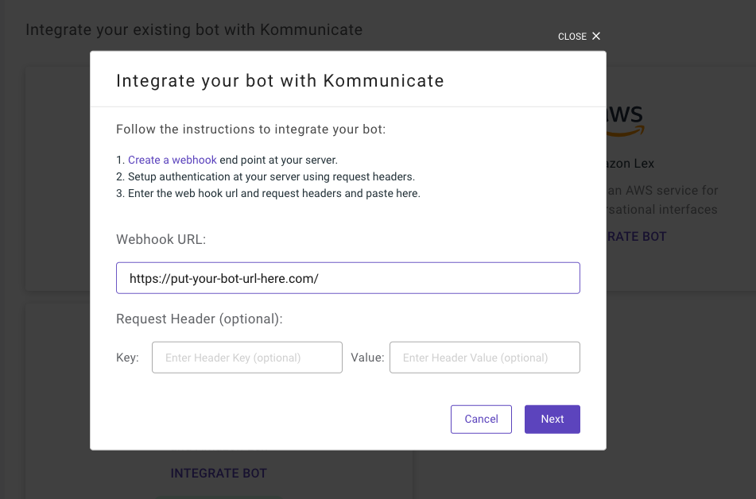
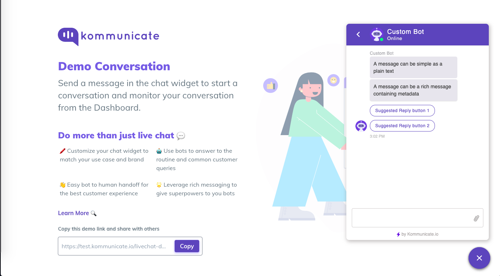

# A sample server for custom bot integration

This is a sample project to demonstrate how to create a server for your custom bot integration.


## Prerequisites

###Required Packages: 
* Node Version: v10.16.0 or higher
* Latest version of npm


### Running the server

This app will run in two simple steps

Go to the directory where you have cloned this project and run this command:

```
npm install
```

After this just run:

```
node index.js 3000
```
here **3000** is the port number which your server will be using to listen to requests. You can always replace it with some other port number(8080,1234,3999)

If you see the line ```The server is running on port: 3000``` that means our app is up and running. :raised_hands:


### Hosting :rocket:

You can host this server globally using services like [ngrok](https://www.npmjs.com/package/ngrok) or [localtunnel](https://www.npmjs.com/package/localtunnel).

### Integrating with Kommunicate :muscle:

Once the server is live you can just paste the url in custom bot integration to create your bot. 



After the bot is integrated you can go and test the bot by sending any message. You should be able to see something like this..




> Read more about custom bot Integration with Kommunicate [here.](https://docs.kommunicate.io/docs/bot-custom-integration)

### Built With

* [Express](https://www.npmjs.com/package/express) - The web framework used
* [Body-Parser](https://www.npmjs.com/package/body-parser) - for request parsing


### Author

 *Hardik Parashar*


