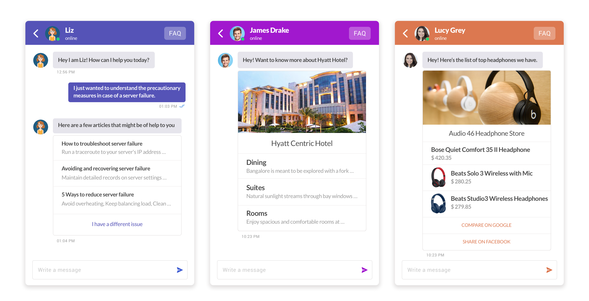
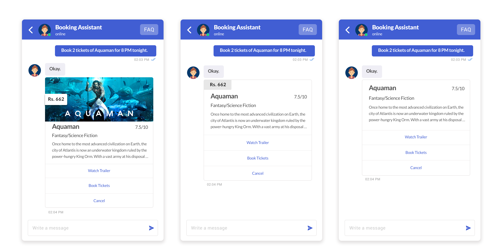
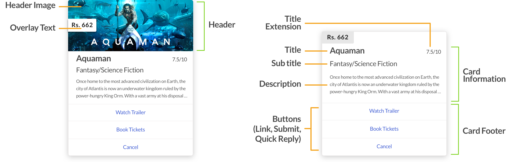
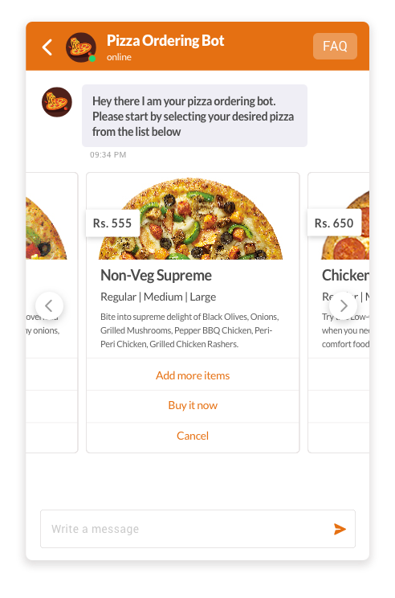
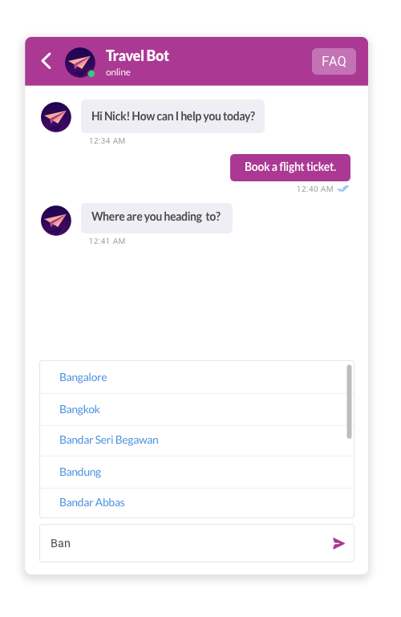

## Overview
Only rendering text is not enough to make a conversation interactive, fruitful, and easy to act upon. Actionable Messages in Kommunicate help you make chat conversations more interactive.

Kommunicate allows you to add several other interactive components in conversations such as Images, Audios, and Video in the form of Message Templates, Suggested Replies, Buttons, Cards, Lists, and other actionable items to provide a rich messaging experience.

## How to use Actionable Messages in chat?

### Dialogflow custom payload
Pass the Actionable Messages metadata as custom payload in Dialogflow to render Actionable Messages while using a Dialoflow bot. See how to set up Actionable Messages in Dailoglow bot [here](bot-configration#use-actionable-messages-to-make-conversations-interactive).

### Send message API
You can use [Send message API](api-detail#send-message) to add Actionable Messages.

### Custom bots
If you are using custom bots, pass the Actionable Message template as metadata in the message. Learn more about using Actionable Message in custom bots [here](bot-custom-integration).

Kommunicate renders a valid JSON into Actionable Message. Pass the JSON described below as metadata to utilize Actionable Messages. This example renders Suggested Replies along with the message:

 ```JSON
 {
	"message":"Do you want more updates?",
	"ignoreTextResponse": false,
    "platform":"kommunicate",
    "metadata": {
        "contentType": "300",
        "templateId": "6",
        "payload": [{
            "title": "Yes",
            "message": "Cool! send me more."
        }, {
            "title": "No ",
            "message": "Don't send it to me again"
        }]
    }
}
```
If you're passing both the text response and custom payload in intent and want to hide the text response you can pass `ignoreTextResponse: true`. 

Here is a list of available Actionable Messages you can use in Kommunicate chat:

* Buttons
    * Link Buttons
    * Submit Buttons
* Suggested Replies
* Images
* List
* Cards
	* Generic Card
	* Card Carousel

## Buttons 

You can add any number of Buttons in your conversations for faster navigation. There are two types of Buttons supported in Kommunicate:

### Link Button
Link Button redirects users to a given URL in a new tab. Use the below metadata to render the Link Buttons:

```JSON
{
	"message": "click on the buttons",
	"platform":"kommunicate",
	"metadata": {
		"contentType": "300",
		"templateId": "3",
		"payload": [{
				"type": "link",
				"url": "https://www.google.com",
				"name": "Go To Google"
			},
			{
				"type": "link",
				"url": "https://www.facebook.com",
				"name": "Go To Facebook",
				"openLinkInNewTab": false
			}
		]
	}
}
```
Use `openLinkInNewTab: true` to open any link in new tab. Default value is `false`, which will open the links in the same window.

### Submit Button 
Submit Button allows you to post given data or redirect the user to a given URL. If parameter `requestType:json` is included, it will post the data with content type `application/json` on the `formAction` URL and the `replyText` will be used as acknowledgement message. 

Default value for `replyText` is same as the value passed in `name` parameter. If `requestType` parameter is not passed, it will submit the `formData` with contentType `application/x-www-form-urlencoded` and redirect the user on `formAction` URL. The response will be rendered in new tab.
  
```JSON
{
	"message": "click the pay button",
	"platform": "kommunicate",
	"metadata": {
		"contentType": "300",
		"templateId": "3",
		"payload": [{
			"name": "Pay",
			"replyText":"optional, will be used as acknowledgement message to user in case of requestType JSON. Default value is same as name parameter"
		}],
		"formData": {
			"amount": "1000",
			"description": "movie ticket"
		},
		"formAction": "https://example.com/book",
		"requestType":"json"   
	}
}
```

## Suggested Replies

Suggested Replies provide a way to send messages on a click without typing them all out manually. These are essentially the same as Suggestion Chips in Dialogflow and Postback Buttons in Facebook.

>Note: Suggested Replies were previously called Quick Replies.

You can add any number of Suggested Replies by passing values in the metadata as described below:

```JSON
{
	"message": "Do you want more updates?",
	"platform": "kommunicate",
	"metadata": {
		"contentType": "300",
		"templateId": "6",
		"payload": [{
			"title": "Yes",
			"message": "Cool! send me more."
		}, {
			"title": "No",
			"message": "Not at all",
			"replyMetadata": {
				"KM_CHAT_CONTEXT": {
					"buttonClicked": true
				}
			}
		}]
	}
}
```
`replyMetadata` helps you to send custom data along with every suggested reply. Pair it with [KM_CHAT_CONTEXT](bot-dialogflow-integration#pass-custom-data-to-bot-platform) to receive data back when user click on the suggested reply. 
The appearance of the Suggested Replies and Buttons will be adjusted automatically according to the customization you have done on your chat widget.

## Images
Images can be rendered in conversation using below JSON. The image object contains a caption(optional) and an image URL. You can send a list of image objects in the payload. There is no action supported on image template.

```JSON
{
  "message": "Hey I am Kommunicate support bot",
  "platform":"kommunicate",
  "metadata": {
    "contentType": "300",
    "templateId": "9",
    "payload": [
      {
        "caption": "Image caption",
        "url": "Image URL"
      }]
  }
}

```
## List Template

The list template is a list of structured items with an optional header image and header text.



### Components of a List Template
A list template may contain below items:

* Header Image  &nbsp;&nbsp;<font color='#9b9b9b'>(Recommended size: 910*330px)</font>
* Header text   &nbsp;&nbsp;<font color='#9b9b9b'>(Character limit: 75)</font>
* List of items: Each item may contain below components:

   * Thumbnail image&nbsp;&nbsp;<font color='#9b9b9b'>(Recommended size: 150*150px)</font>
   * Title &nbsp;&nbsp;<font color='#9b9b9b'>(Character limit: 32)</font>
   * Description &nbsp;&nbsp;<font color='#9b9b9b'>(Character limit: 35)</font>
   * The action of the item
       
* List of buttons: Each button may contain below components:

   * Name of button
   * The action of the button


### Actions on the List
There are two types of action supported on list items and buttons.

* Link: It will navigate the user to another page in a new tab.

* Suggested Replies: It will send a message with given text if passed. The default value will be the title of the list item or name of the button. The action is specified by the action object passed along with each item and button. This is how the action object looks like :


```JSON
// for Suggested Reply, the action object will look like this:  
"action": {
	"type": "quick_reply",
	"text": "This text will be sent as message" 
}

// for Link, the action object will look like this:
"action": {
	"type": "link",	
	"url": "URL to navigate other page"
} 
```
> **Note:** Any URL provided in `url` key above will open that URL in a new tab.


Here is the sample JSON for the List Template:

```JSON
{
	"message": "This is the sample json for list template",
	"platform": "kommunicate",
	"metadata": {
		"contentType": "300",
		"templateId": "7",
		"payload": {
			"headerImgSrc": "URL for header image",
			"headerText": "Header text.",
			"elements": [{
				"imgSrc": "Thumbnail icon for list item",
				"title": "List item 1",
				"description": "Description for the list item",
				"action": {
					"url": "https://www.google.com",
					"type": "link"
				}
			}],
			"buttons": [{
				"name": "See us on facebook",
				"action": {
					"url": "https://www.facebook.com",
					"type": "link"
				}
			}]
		}
	}
}
```

## Cards
The card template is a list of structured items with title, subtitle, image, and buttons. There are two types of Cards supported in Kommunicate:
* Generic Card
* Carousel Card

### Generic Card


<br><br>
**Components of card template** <br>
<br>
A card template may contain below items:
<br><br>


<br>
* Header
   
     * Image (optional)  &nbsp;&nbsp; <font color='#9b9b9b'>(Recommended size: 720*280px)</font>
     * Overlay text (optional)
	
* Card information section
   
     * Title &nbsp;&nbsp; <font color='#9b9b9b'>(Character limit: 16)</font>
     * Title extension (optional) 
     * Subtitle &nbsp;&nbsp; <font color='#9b9b9b'>(Character limit: 56)</font>
     * Description &nbsp;&nbsp; <font color='#9b9b9b'>(Character limit is 99 and use \n to break the line.)</font>
   
* Card footer may contain a list of buttons, it can be:
   
     * Link Button
     * Submit Button
     * Suggested Replies

**Actions on the button** <br>

   * Link: It will navigate the user to another page in a new tab.
   
   * Submit Button: Submit Button allows you to post given data or redirect the user to a given URL. 
   
   * Suggested Replies: It will send a message with given text if passed. The default value will be the title of the list item or name of the button. The action is specified by the action object passed along with each item and button. <br>
	
Here are the actions you can perform on click of the buttons:

Sample `"action"` object for Suggested Reply:

```JSON 
"action": {
	"type": "quickReply",
	"payload": {
		"title": "Yes",
		"message": "text will be sent as message",
	}
}
```

Sample `"action"` object for navigation link:
```json
"action": {
	"type": "link",
	"payload": {
		"url": "https://www.facebook.com"
	}
}
```

Sample `"action"` object for Submit Button:
```json	 
"action": {
	"type": "submit",
	"payload": {
		"text": "Button text",
		"formData": {
			"amount": "1000",
			"description": "movie ticket"
		},
		"formAction": "https://example.com/book",
		"requestType": "json"
	}
}		  
```
Here is the sample JSON for the single card:

```json
{
  "message": "This is the sample json for card template",
  "platform": "kommunicate",
  "metadata": {
    "contentType": "300",
    "templateId": "10",
    "payload": [
      {
        "title": "Card Title",
        "subtitle": "Card Subtitle ",
        "header": {
          "overlayText": "Overlay Text",
          "imgSrc": "Header image for the card"
        },
        "description": "Description",
        "titleExt": "Title extension",
        "buttons": [
          {
            "name": "Link Button",
            "action": {
              "type": "link",
              "payload": {
                "url": "https://www.facebook.com"
              }
            }
          }
        ]
      }
    ]
  }
}
```
You can add any number of buttons in your card footer.

### Card Carousel

The Kommunicate chat widget supports sending of a horizontally scroll-able carousel of generic templates.



The payload is an array of objects, each object can be different cards. So you can pass multiple objects inside the payload.

Here is the sample JSON for the card carousel:

```JSON
{
  "message": "Carousel",
  "platform": "kommunicate",
  "metadata": {
    "contentType": "300",
    "templateId": "10",
    "payload": [
      {
        "title": "OYO Rooms 1",
        "subtitle": "Kundanahalli road turn.",
        "header": {
          "overlayText": "$400",
          "imgSrc": "http://www.tollesonhotels.com/wp-content/uploads/2017/03/hotel-room.jpg"
        },
        "description": "Bharathi Road \n Near Head Post Office",
        "titleExt": "4.2/5",
        "buttons": [
          {
            "name": "Link Button",
            "action": {
              "type": "link",
              "payload": {
                "url": "https://www.facebook.com"
              }
            }
          },
          {
            "name": "Suggested Reply",
            "action": {
              "type": "quickReply",
              "payload": {
                "title": "Yes",
                "message": "text will be sent as message",
                "replyMetadata": {
                  "key1": "value1"
                }
              }
            }
          },
          {
            "name": "Submit button",
            "action": {
              "type": "submit",
              "payload": {
                "text": "acknowledgement text",
                "formData": {
                  "amount": "$55",
                  "description": "movie ticket"
                },
                "formAction": "https://example.com/book",
                "requestType": "json"
              }
            }
          }
        ]
      },
      {
        "title": "OYO Rooms 2",
        "subtitle": "Kundanahalli ",
        "header": {
          "overlayText": "$360",
          "imgSrc": "http://www.tollesonhotels.com/wp-content/uploads/2017/03/hotel-room.jpg"
        },
        "description": "Bharathi Road | Near Head Post Office, Cuddalore 607001",
        "titleExt": "4.2/5",
        "buttons": [
          {
            "name": "Link Button",
            "action": {
              "type": "link",
              "payload": {
                "url": "https://www.facebook.com"
              }
            }
          },
          {
            "name": "Submit button",
            "action": {
              "type": "submit",
              "payload": {
                "text": "acknowledgement text",
                "formData": {
                  "amount": "$22",
                  "description": "movie ticket"
                },
                "formAction": "https://example.com/book",
                "requestType": "json"
              }
            }
          },
          {
            "name": "Suggested Reply",
            "action": {
              "type": "quickReply",
              "payload": {
                "title": "Yes",
                "message": "text will be sent as message",
                "replyMetadata": {
                  "key1": "value1"
                }
              }
            }
          }
        ]
      },
      {
        "title": "OYO Rooms 3",
        "subtitle": "Kundanahalli ",
        "header": {
          "overlayText": "$750",
          "imgSrc": "http://www.tollesonhotels.com/wp-content/uploads/2017/03/hotel-room.jpg"
        },
        "description": "Bharathi Road | Near Head Post Office, Cuddalore 607001",
        "titleExt": "4.2/5",
        "buttons": [
          {
            "name": "Link Button",
            "action": {
              "type": "link",
              "payload": {
                "url": "https://www.facebook.com"
              }
            }
          },
          {
            "name": "Submit button",
            "action": {
              "type": "submit",
              "payload": {
                "text": "acknowledgement text",
                "formData": {
                  "amount": "$45",
                  "description": "movie ticket"
                },
                "formAction": "https://example.com/book",
                "requestType": "json"
              }
            }
          },
          {
            "name": "Suggested Reply",
            "action": {
              "type": "quickReply",
              "payload": {
                "title": "Yes",
                "message": "text will be sent as message",
                "replyMetadata": {
                  "key1": "value1"
                }
              }
            }
          }
        ]
      }
    ]
  }
}
```


## Use autosuggestions in your chat box

Autosuggestions make your users' life easier by populating the list of possible answers/data in the chat itself (see the image below). 

If you want to ask any question or enter any text message into the chat box and send possible answers or list of data with that question, you can pass a list of answers or data into metadata. It will be displayed in the suggestion list. Suggestion list can also be fetched from a source URL/server if you pass source URL into the message. 




The format of the message is as below:
 
 ```json
{
	"message": "Where do you wanna go this summer?",
	"platform":"kommunicate",
	"metadata": {
		"KM_AUTO_SUGGESTION": {
			"placeholder": "enter city name ",
			"source": []
		}
	}
}
```

`"placeholder"` (optional) will appear in the chat input field as placeholder text. The `"source"` can be any one of the below formats:

 * **Array of string**
 ```JSON
{
 	"source": [
 		"London",
 		"New York",
 		"Delhi"
 	]
 }
```

* **Array of object**
```JSON
{
	"source": [{
			"searchKey": "Photography",
			"message": "Photography Lessons"
		},
		{
			"searchKey": "passport visa Services",
			"message": "Passport & Visa Services"
		}
	]
}
```
* **Url**: Pass the API endpoint to get the data. Kommunicate will send data in the query parameter. 

```json
{
	"source": {
		"url": "<API_ENDPOINT>",
		"headers": {}
	}
}
```
The API should return data in below format : 

```json
[{
    "searchKey": "searchable value",
    "name": "Text message which you want display/send into conversation.",
    "metadata": {"key":"value"} //optional, any extra information you want to send with message
}]
```
`"metadata"` is any extra information you want to send with the message. This field is optional.

## Send HTML content 
> HTML content will work with V2 APIs.

You can send HTML content as a message and Kommunicate will render the HTML in the UI. Pass the property `messageType: html` in custom payload from Dialogflow. You can send a standalone HTML message or combine it with Actionable Messages. Below is the sample JSON with Suggested Replies:

Sample JSON with HTML in Suggested Replies:
```JSON
{
	"message": "<ul><li> Bangalore </li><li> California </li><li> Singapore </li><li> London </li></ul>",
	"platform": "kommunicate",
	"messageType":"html",
	"metadata": {
		"contentType": "300",
		"templateId": "6",
		"payload": [{
			"title": "Show More",
			"message": "Show me more"
		}]
	}
}
```
