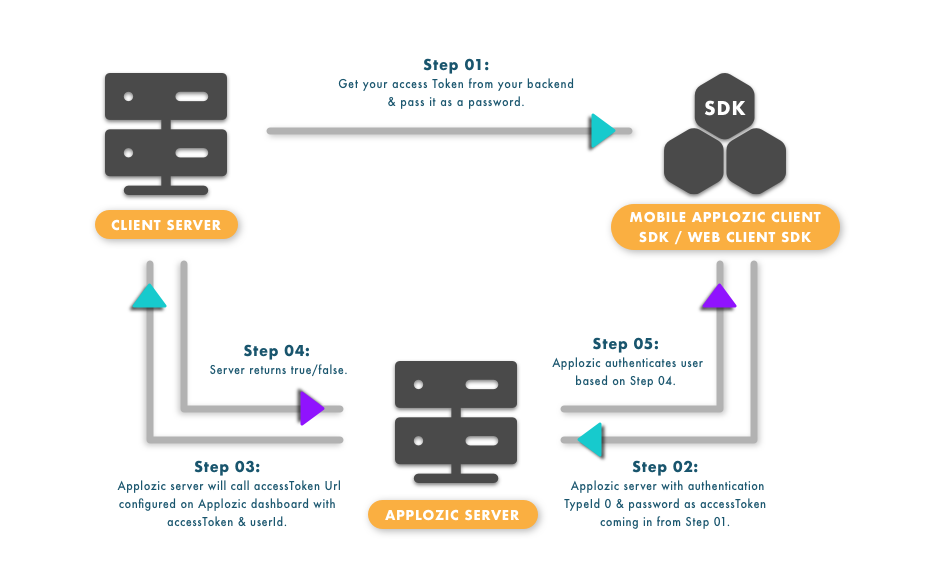

Access Token URL (Authentication URL) is required to ensure your platforms are safe from unauthorized access. Access Token URL can be configured by the Application admin in Kommunicate Dashboard for authenticating users from your backend server. 


> Login to [Kommunicate](https://www.kommunicate.io). Go to `Dashboard -> Webhooks and Security`. Scroll down to Security section and enter your server URL for authentication in input field.

This URL should accept POST request with the following two request parameters.
The user should provide the access token in the **accessToken** option while initializing the plugin.



| Parameter  | Description |
| ------------- | ------------- |
| userId | userId of the user who should be authenticated |
| token | Access token for the specified user |

**Response**: Response text received on configured URL:

```text
true        \\ If user is authenticated
false       \\ If user is not authenticated
```

> **NOTE:** API Response should be in text format.