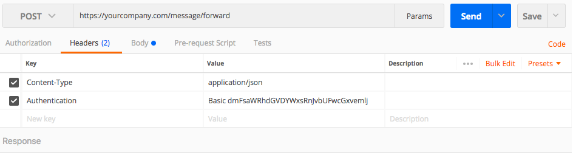

Configure webhook Url  in Kommunicate dashboard. All messages will be send to the configured webhook Url in JSON format.
 Login to [Kommunicate ](https://www.kommunicate.io).
Go to Dashboard -> Settings -> [Webhooks & Security](https://dashboard.kommunicate.io/settings/webhooks-security)

Add authentication to this post data request by configuring webhook authentication token in Kommunicate dashboard. This authentication token can be any random string.
Scroll down to the **Security** section in **Webhooks & Security** page

> **NOTE:** We recommend configuring this authentication token in Kommunicate dashboard as it adds authentication layer for all the API call going from Kommunicate to your server. This authentication token will be passed as **Authentication**  header in the form of base64 value of authentication token.\nBasic Base64Encode of authentication token\nExample: **Basic YWJjZGVm**

Now Kommunicate Server POST data to the configured Url with following headers:

**API URL**:  https://yourcompany.com/message/forward

**Method Type**: POST

**Headers**: <br>
**Content-Type**:  application/json<br>
**Authentication**:  Basic Base64Encode of authentication token

if authentication token configured in dashboard is **abcdef** than sample value will be:
**Basic YWJjZGVm**

**Request Body**:  Posted JSON to configured URL without any attachment :
```json
  {
    "key":"message key",
    "from":"sender unique id",
    "to":"receiver unique id",       // In case of One to One Chat
    "groupId": 123456,              // In case of Group Chat
    "clientGroupId": "123456",      // In case of Group Chat
    "groupName": "applozicGroup",   // In case of Group Chat
    "conversationId": 23456,        // In case of Contextual Chat
    "message":"message content",
    "timeStamp":1457958424000,  // Long timestamp value
    "receiverConnected": true,  // Boolean value
    "receiverLastSeenAtTime": 1457958424000 //Long timestamp value
  }
```

Sample Request Call through [POSTMAN](https://chrome.google.com/webstore/detail/postman/fhbjgbiflinjbdggehcddcbncdddomop?hl=en)




**Request Body**: Posted JSON to configured Url with attachment and metadata passed in the message:
```json
  {  
    "key":"message key",
    "from":"sender userId ",
    "to":"receiver userId",             // In case of One to One Chat
    "groupId": 123456,                  // In case of Group Chat
    "clientGroupId": "123456",          // In case of Group Chat
    "groupName": "applozicGroup",       // In case of Group Chat
    "conversationId": 23456,            // In case of Contextual Chat
    "message":"message content",
    "timeStamp":1461590467000,
    "file":{  
      "name":"name of attachment image,file etc",
      "url":"attachment Url",
      "contentType":"image/gif",
      "size":28150,
      "thumbnailUrl":"attachment thumbnail Url"
    },
    "metadata":{
      "key1":"value1",
      "key2":"value2"
    }
  }
```