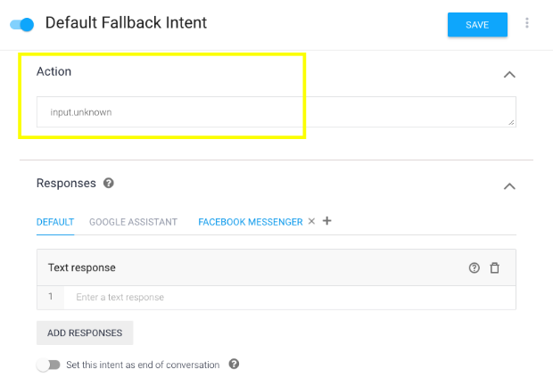
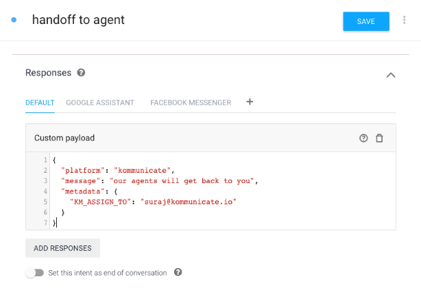

## Overview
Conversation Assignment is the set of rules you can apply to manage conversations among your team members(humans and bots). You can assign and route conversations between your team members to effectively manage all the incoming conversations. You can find these rules in [Conversation Rules](https://dashboard.kommunicate.io/settings/conversation-rules) section in the Dashboard.


Here are the guidelines on how to use conversation rules for humans and bots:

## Routing rules for human agents

### Automatic assignment
If the automatic assignment is enabled, all the incoming conversation will be assigned to the human agents in a round robin manner. All the human agents who are offline or in 'Away' mode will be skipped in the routing. In case all the human agents are offline, the conversation will be assigned to the Default agent. You can set the default agent from the same section.

### Notify everybody
If notify everybody is enabled, then the conversation will be assigned to a default agent and notifications will be sent to everybody. Anybody can assign that conversation to themselves after that.

>Note: In case 'Assign new conversations to bot' is enabled, then irrespective of the routing rules for human agents, the conversation will be assigned to the 'selected bot'.


## Routing rules for bots

### Assign new conversations to bot
If enabled, all the incoming conversations will be assigned to the selected bot. You can choose the selected bot from the drop down.

A few points to note when the conversations are assigned to a bot:

 - If the bot is not able to answer:
 	- The conversation will be assigned to default human agent if  **Notify everybody** is selected in the agent routing rules.
 	- The conversation will be assigned to the human agent present in the conversation for **Automatic assignment**.
 
 - The Welcome and Away messages configured from the Dashboard will not come. The welcome messages configured by the bot will come here. 
 - The **Take over from bot** button will be displayed in the the conversation, if the human agent takes over from the bot, conversation will assign to that particular agent.


## Bot to human handoff
Bot to human handoff comes in handy when the bot is unable to answer the customer or is unable to understand what the customer is saying. There are multiple ways bot can assign the conversation to agents:

1. On action `input.unknown`:

* In Dialogflow, every intent has an action. In an Intent, you can set the action from the ‘action and parameter’ section while creating or updating an intent. The “Input.unknown” action is built into Dialogflow and associated with the default fallback intent (created and enabled by default when a bot is created in Dialogflow). 
* When none of the intents are matched, the default fallback intent is triggered and action associated with it is added in the response.  Kommunicate uses this action to handoff the conversation to a support agent. Whenever action “input.unknown” is detected in the response,  Kommunicate automatically assigns a conversation to a support agent based on the aforementioned routing rules. You can add an action “input.unknown” to any intent to handoff the conversation to a support agent or remove it from the default fallback intent to disable automatic handoff to support agents.



2. To assign a conversation to a specific support agent:

- Add the JSON code below (as a custom payload) to the response of the Intent. Specify the agent's email ID (same email ID which an agent uses to log into the Kommunicate dashboard) in `KM_ASSIGN_TO` parameter. If `KM_ASSIGN_TO` parameter is left empty, the conversation routing rules will be applied and the conversation will be assigned to a support agent based on the routing rules.

```js
{
  "platform": "kommunicate",
  "message": "our agents will get back to you", //optional 
  "metadata": {
    "KM_ASSIGN_TO": "agent's userId" // pass empty string to use conversation routing rules. 
  }
}
```
- Click on the Intent in Dialogflow console.  
- In the response section, click on “Add Responses” then select “Custom Payload”.
- Modify the sample JSON according to your specific needs and paste it in the “Custom Payload” section.
- Save the intent and let the agent complete the training.



## Handoff a conversation to another bot 
If you have multiple bots running, you can hand off the conversation to another bot when specific intent is matched. You can trigger an event so that your bot will get exact context rather than starting from the beginning. Set the below JSON as custom payload to handoff the conversation to another bot:

```js
{
	"platform": "kommunicate",
	"message": "Forwarding your request to a teammate who is expert in this",
	"metadata": {
		"KM_ASSIGN_TO": "your-bot-id",
		"event": {
			"name": "WELCOME", // event to be triggered
			"data": {} // data will be sent to your webhook in "originalDetectIntentRequest" parameter.
		}
	}
}
```
