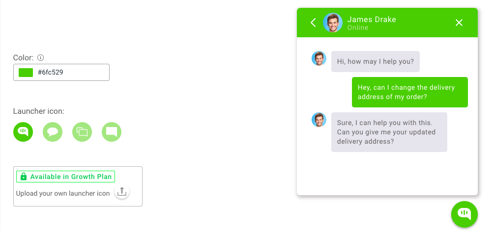

## Overview

Kommunicate chat widget is where your users will chat and interact with your team. You can customize the theme, look and feel of the chat widget to fit with your brand's theme. You can either do it through Kommunicate Dashboard or add your own customization code manually.

## Chat widget customization

You can change the primary color of your chat widget to your choice of color. The primary color of the elements inside the chat widget will also be changed to that color. 

You can also change the chat launcher icon from our given list of multiple icons. You will find these settings in 
<a href="https://dashboard.kommunicate.io/settings/chat-widget-customization" target="_blank">Kommunicate Dashboard -> Chat widget</a>.



If you are in one of our paid plans, you can also upload your own image/icon and use as your customized chat launcher icon.  Though, there are no hard restrictions of the shape of the image you want to use as the chat widget launcher icon, square images are preferred over others.

## Customize chat widget by using CSS

Alternatively, you can pass custom CSS to customize the chat widget. Pass the CSS in `Kommunicate.customizeWidgetCss()` method as a string like shown in the example below.

```javascript
var kommunicateSettings = {
    ...
    "onInit": function() {
        var css = "<YOUR_CSS_CODE_HERE>";        // Replace <YOUR_CSS_CODE_HERE> with the CSS you want to override.
        Kommunicate.customizeWidgetCss(css);
    },
    ...
}
```

#### To change sent messages color

```javascript
Example : 

var cssChanges = ".mck-msg-right .mck-msg-box{background-color: blue!important;color:yellow!important;}";
Kommunicate.customizeWidgetCss(cssChanges);

```

#### To change received messages color

```javascript
Example :

var cssChanges = ".mck-msg-left .mck-msg-box{background-color: blue!important;color:yellow!important;}";
Kommunicate.customizeWidgetCss(cssChanges);

```

#### To show/hide the chat widget
To hide the chat widget you can add the following CSS in your website's CSS file:

```CSS
/* To hide the Chat Widget */
#kommunicate-widget-iframe {
    display: none;
}
```

To show the chat widget on click of a button use the following code:

```javascript
var btn = document.getElementById("button"); //Assuming this the button on your website from where you will trigger the click event to show the chat widget

btn.addEventListener("click", function() {
    document.getElementById("kommunicate-widget-iframe").style.display = 'block';
});
```

### Make chat widget full screen or add it in a container
To make the chat widget full screen or to add it in a container, follow the instructions given in the readme of https://github.com/CaptainT33mo/captaint33mo.github.io

## Default metadata 
You can pass on additional information as metadata with every message. Add `defaultMessageMetaData` parameter in `kommunicateSettings` variable. Below is the example of how you can send metadata:

```javascript
var kommunicateSettings = {
    ...
    "defaultMessageMetaData":{"key1":"value1", "key2":"value2", ...}
    ...
};

```
> Note: You can also update metadata using [KM_CHAT_CONTEXT](web-botintegration#pass-custom-data-to-bot-platform).

## Events
To get real time updates regarding message sent and delivered you can subscribe to **onMessageSent** & **onMessageReceived** events.

1. **onMessageSent** :  This event gets triggered when the message is sent by the user.
2. **onMessageReceived** : This event gets triggered when a new message is received by the user. 


### Example on how to subscribe to events
To subscribe to events you need to call Kommunicate.subscribeToEvents(events) function and pass the events object in it.

```javascript
var kommunicateSettings = {
    ...
    "onInit": function () {
        var events = {
            'onMessageReceived': function (resp) {
            console.log(resp);
            //called when a new message is received
            },
            'onMessageSent': function (resp) {
            console.log(resp);
            //called when the message is sent
            }
        };
        Kommunicate.subscribeToEvents(events);
    },
    ...
}
```